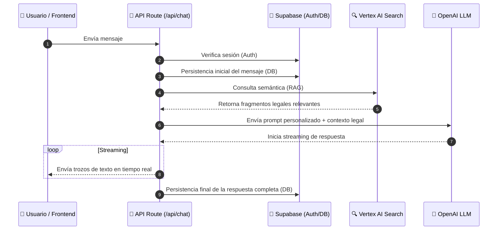

# Chatbot de Derecho Virtual ⚖️🤖

Una plataforma inteligente diseñada para ayudar a estudiantes de derecho a través de tutorías impulsadas por Inteligencia Artificial, utilizando técnicas avanzadas de **RAG (Retrieval-Augmented Generation)**.

> [!TIP]
> **Para Evaluadores:** Puedes consultar la [Documentación Técnica Detallada](file:///c:/Users/Alvaro/.gemini/antigravity/scratch/chatbot/DOCUMENTACION_TECNICA.md) para ver la justificación del stack, diagramas de arquitectura avanzados y detalles de implementación.

---

## 🏗️ Arquitectura del Sistema

El proyecto sigue una arquitectura de **Next.js Fullstack** con una integración profunda de servicios de IA de Google Cloud y OpenAI.

### Diagrama de Flujo RAG


### Componentes Clave

1.  **Frontend (Next.js 15)**: 
    - Interfaz reactiva construida con **Tailwind CSS**.
    - Manejo de estados de conversación y streaming de respuestas de texto en tiempo real.
    - Componentes modulares para login, registro y chat.

2.  **Capa de Autenticación y Datos (Supabase)**:
    - **Auth**: Gestión de sesiones de estudiantes.
    - **PostgreSQL**: Almacenamiento de conversaciones y mensajes para persistencia entre sesiones.

3.  **Motor de Búsqueda de Conocimiento (Vertex AI Search)**:
    - Utiliza la API de **Discovery Engine** de Google Cloud para realizar búsquedas semánticas sobre manuales y documentos legales cargados en el Data Store.
    - Provee contexto preciso (RAG) para evitar alucinaciones en temas legales.

4.  **Generación de Lenguaje (OpenAI)**:
    - Orquestación del diálogo pedagógico utilizando modelos avanzados de OpenAI.
    - Aplicación de los métodos **Socrático** y **Feynman** mediante System Prompts configurados.

---

## 🌟 Características Principales

- **Tutoría Pedagógica**: Guía al estudiante mediante preguntas y comprobación de conceptos (Método Socrático/Feynman).
- **RAG con Vertex AI Search**: Búsqueda semántica en tiempo real en fuentes oficiales.
- **Streaming de Respuestas**: Interfaz fluida con respuestas tipo "teletipo" en tiempo real.
- **Historial de Conversaciones**: Los estudiantes pueden retomar sus sesiones de estudio anteriores.
- **UI Premium**: Diseño moderno con micro-interacciones, modo oscuro y estética cuidada.

---

## 🛠️ Stack Tecnológico

- **Frontend/Backend**: [Next.js 15](https://nextjs.org/) (App Router)
- **Base de Datos y Auth**: [Supabase](https://supabase.com/)
- **IA Generativa**: [OpenAI](https://openai.com/)
- **Búsqueda Semántica (RAG)**: [Google Vertex AI Search](https://cloud.google.com/generative-ai-app-builder/docs/enterprise-search-introduction)
- **Estilos**: [Tailwind CSS](https://tailwindcss.com/)
- **Componentes**: Lucide React, React Markdown.

---

## 🚀 Configuración del Proyecto

### Requisitos Previos

- Node.js 20+ instalado.
- Cuenta de Supabase.
- API Key de OpenAI.
- Proyecto en Google Cloud con Vertex AI Search habilitado y un Data Store configurado.

### Instalación

1.  Clona el repositorio:
    ```bash
    git clone https://github.com/alvaromt6/chatbotDerechoVirtual.git
    cd chatbotDerechoVirtual
    ```

2.  Instala las dependencias:
    ```bash
    npm install
    ```

3.  Configura las variables de entorno (`.env.local`):
    ```env
    # OpenAI
    OPENAI_API_KEY=tu_api_key

    # Supabase
    NEXT_PUBLIC_SUPABASE_URL=tu_url_supabase
    NEXT_PUBLIC_SUPABASE_ANON_KEY=tu_anon_key
    SUPABASE_SERVICE_ROLE_KEY=tu_service_role_key

    # Vertex AI
    VERTEX_PROJECT_ID=id_de_tu_proyecto
    VERTEX_LOCATION=global
    VERTEX_COLLECTION=default_collection
    VERTEX_ENGINE_ID=id_de_tu_data_store
    VERTEX_SERVING_CONFIG=default_config
    GOOGLE_APPLICATION_CREDENTIALS_JSON='{...contenido_del_json...}'
    ```

### Desarrollo

Ejecuta el servidor de desarrollo:
```bash
npm run dev
```
Abre [http://localhost:3000](http://localhost:3000) en tu navegador.

---

## 📖 Uso

El chatbot está diseñado para estudiantes de Derecho. No solo responde preguntas, sino que actúa como un tutor. Si el estudiante tiene dudas sobre un concepto legal, el chatbot:
1.  Busca en los manuales autorizados vía **Vertex AI Search**.
2.  Provee la base legal.
3.  Guía al estudiante para que saque sus propias conclusiones.

---

## 🔌 Documentación de la API

### Endpoint: `POST /api/chat`
Este es el motor principal del chatbot. Gestiona la autenticación, la recuperación de contexto (RAG) y la generación de respuestas en streaming.

#### Configuración del Modelo
> [!IMPORTANT]
> El sistema utiliza el modelo **GPT-5.2 Optimizado** para Derecho. Este modelo ha sido configurado con una `temperature: 0.4` para garantizar que las respuestas sean precisas desde el punto de vista legal, evitando divagaciones innecesarias del LLM.

#### Cuerpo de la Petición (JSON)
| Parámetro | Tipo | Descripción |
| :--- | :--- | :--- |
| `message` | `string` | La consulta actual del estudiante. |
| `history` | `array` | Historial de mensajes previos para mantener el contexto. |
| `studentName` | `string` | Nombre del alumno para personalización (Socrático). |
| `conversationId` | `string` | Identificador único de la sesión de chat. |

#### Flujo de la Respuesta
1.  **Búsqueda en Vertex AI**: Se analizan los fragmentos de manuales legales más relevantes.
2.  **Inyección de Contexto**: Se añade el bloque `📚 DOCUMENTACIÓN AUTORIZADA` al prompt.
3.  **Generación GPT-5.2**: Se produce una respuesta que sigue el método pedagógico configurado.
4.  **Streaming**: La respuesta se envía al cliente en tiempo real mediante trozos (*chunks*) de texto.

---

## 📄 Licencia

Este proyecto está bajo la Licencia MIT.
